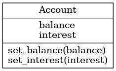
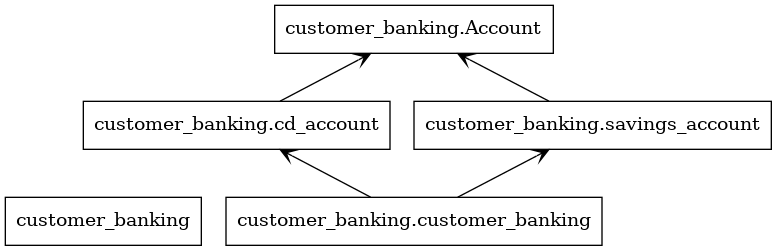

# Module 3 Assignment

# By: Mark Wireman

The assignment is a terminal based interest earned calculator for a Savings and CD account. The interest calculator system will prompt for a current balance, the interest rate, and months to maturity for each account.

A balance is returned that includes the interest earned and will also show the interest amount.

To use, run the following command from the main folder:

python customer_banking.py

The program will first prompt for the savings account details as follows:

You'll now be prompted to enter the current balance, interest rate, and lenght of months for the savings account.
Current savings account balance:1000
Current savings account interest rate:2
Enter number of months the savings account matures:36

When all values have been entered, the updates savings account balance and the interest earned will be calculated and displayed.

Updated savings balance is $1060.00 and interest earned is $60.00.

The same prompts and displays will follow for the CD account.

## The program architecture is as follows:

Account Class

Banking and Account types modules